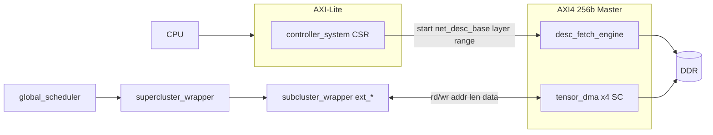

# PHASE 5 — Giao tiếp CPU ↔ IP và phân loại dữ liệu

Tài liệu này tổng hợp từ `RTL_IP_DIRECTORY_TREE.txt` (PHASE_5) và mã RTL trong `PHASE_3`, mô tả **điểm vào/ra** của IP, **module liên quan**, và **loại dữ liệu** dùng cho điều khiển / tensor / lượng tử hóa. Dùng làm bước 1 trước khi đi sâu “lấy data và xử lý” trong compute path.

---

## 1. Ranh giới SoC (CPU nhìn thấy gì?)

Theo `accel_top.sv`:

| Cổng | Vai trò | Ghi chú |
|------|---------|---------|
| **AXI-Lite slave** (`s_axil_*`) | MMIO — CPU ghi/đọc thanh ghi điều khiển | Không dùng để đẩy hàng loạt tensor |
| **AXI4 master 256b** (`m_axi_*`) | DMA đọc/ghi DDR | Descriptor + input/weight/skip/output |
| **`irq`** | Báo hoàn tất (khi mask cho phép) | Từ `controller_system` |
| **`ppu_*`, `ppu_silu_lut`** | Tham số PPU | **Hiện tại** là cổng top do testbench/driver điều khiển — **không** đi qua CSR trong RTL hiện có |

Địa chỉ CSR: `packages/csr_pkg.sv` (ví dụ `CSR_CTRL`, `CSR_NET_DESC_LO/HI`, `CSR_LAYER_START/END`, `CSR_STATUS`, `CSR_IRQ_MASK`, …).

---

## 2. Luồng điều khiển từ CPU (không phải tensor thô)

1. CPU ghi **địa chỉ 64-bit** của `net_desc` trong DDR (`CSR_NET_DESC_LO`, `CSR_NET_DESC_HI`).
2. CPU ghi **khoảng layer** (`CSR_LAYER_START`, `CSR_LAYER_END`).
3. CPU ghi `CSR_CTRL[0]` = **start** để kick inference.

**Module:** `controller_system.sv`  
- Nhận MMIO, giữ CSR.  
- **`desc_fetch_engine`**: dùng **chính cổng AXI read** (mux với DMA trong `accel_top`) để đọc từ DDR các khối **64 byte** (2 beat × 256b):
  - `net_desc_t` tại `net_desc_base`
  - `layer_desc_t` tại `layer_table_base + layer_id × 64`
  - `tile_desc_t` tại `tile_table_addr + tile_index × 64`

**Module tiếp theo:** `global_scheduler.sv` — nhận tile từ fetch, phân phối tới **4 supercluster** (`sc_tile[4]`, `sc_tile_valid`, handshake `sc_tile_accept`).

**Ý nghĩa:** “Tập lệnh” ở đây là **bảng descriptor trong DDR** (net/layer/tile), không phải opcode từng byte qua MMIO.

---

## 3. Điểm “đón” tensor vào IP và “trả” tensor ra DDR

### 3.1. Đường dữ liệu khối lớn (tensor)

Luồng chuẩn theo spec trong cây thư mục:

`DDR ↔ tensor_dma ↔ (supercluster) ↔ subcluster ×4`

**Module trung tâm DMA:** `07_system/rtl/tensor_dma.sv`

- **Đọc DDR:** `rd_req`, `rd_addr`, `rd_byte_len` → burst AXI read → `rd_data` / `rd_data_valid` / `rd_done`.
- **Ghi DDR:** `wr_req`, `wr_addr`, `wr_byte_len`, `wr_data_in`, `wr_data_valid_in` → burst AXI write → `wr_done`, `wr_beat_accept`.

**Mỗi supercluster:** `07_system/rtl/supercluster_wrapper.sv`

- **FIFO** tile từ `global_scheduler`.
- **`local_arbiter`**: chọn subcluster nào được dùng cổng `ext_*` tới DMA khi nhiều tile/DMA tranh chấp.
- **Một `tensor_dma`** phục vụ 4× `subcluster_wrapper`.

**Ranh giới handshake IP nội bộ ↔ DMA (điểm đón/trả logic):**  
`05_integration/rtl/subcluster_wrapper.sv` — các cổng:

- **Vào IP (từ DDR qua DMA):** `ext_rd_req`, `ext_rd_addr`, `ext_rd_len` → sau khi grant, dữ liệu vào qua `ext_rd_data`, `ext_rd_valid`, kết thúc `ext_rd_done`.
- **Ra khỏi IP (ghi DDR):** `ext_wr_req`, `ext_wr_addr`, `ext_wr_len`, `ext_wr_data`, `ext_wr_valid` → `ext_wr_done`, `ext_wr_beat`.

**Điều phối bên trong tile (ai yêu cầu DMA):** `06_control/rtl/tile_fsm.sv` — các pha `TILE_PREFILL_WT`, `TILE_PREFILL_IN`, `TILE_PREFILL_SKIP`, `TILE_SWIZZLE_STORE` (kèm cờ spill) gắn với `dma_rd_*` / `dma_wr_*`.

### 3.2. Sau khi dữ liệu “đã vào” subcluster (mục tiêu RTL đầy đủ)

Theo ghi chú trong `subcluster_wrapper.sv` và cây mục tiêu:

- **Đệm nhận từ DMA:** `glb_input_bank`, `glb_weight_bank` (+ ghi vào GLB khi prefill).
- **Địa chỉ nội bộ:** `addr_gen_input`, `addr_gen_weight`, `addr_gen_output`.
- **Compute path:** `router_cluster` → `window_gen` → `pe_cluster` → `ppu` → `swizzle_engine` → lại handshake `ext_*` khi cần spill ra DDR.

**Lưu ý hiện trạng code:** file `subcluster_wrapper.sv` vẫn ghi rõ đang dùng nhánh **behavioral** để cosim nhanh — khi “chốt” integration, dữ liệu sẽ khớp spec qua các khối GLB/router/PE/PPU/swizzle như trên.

---

## 4. Địa chỉ DDR cho từng loại tensor (từ descriptor)

Cấu trúc: `packages/desc_pkg.sv`.

### 4.1. `net_desc_t` (bảng mạng)

| Trường | Ý nghĩa |
|--------|---------|
| `layer_table_base` | Bảng `layer_desc` trong DDR |
| `weight_arena_base` | Vùng weight (compiler/loader cộng offset vào tile/layer) |
| `act0_arena_base`, `act1_arena_base` | Ping-pong activation (tùy graph) |
| `aux_arena_base` | Vùng phụ (tùy toolchain) |

### 4.2. `tile_desc_t` — offset DMA trực tiếp trong `tile_fsm`

`tile_fsm` gán (zero-extend 32b → 40b):

| Pha FSM | Địa chỉ AXI read | Độ dài (byte) |
|---------|------------------|---------------|
| `PREFILL_WT` | `src_w_off` | `tile_cin × tile_cout × kh × kw` |
| `PREFILL_IN` | `src_in_off` | theo `valid_h/w`, stride, `kh/kw`, `tile_cin` |
| `PREFILL_SKIP` | `src_skip_off` | `valid_h × valid_w × tile_cout` (residual / e-wise) |
| Ghi output (khi spill) | `dst_off` | `valid_h × valid_w × tile_cout` |

Layout (comment trong `subcluster_wrapper`): input/output **HWC**; weight **OIHW** (contiguous INT8).

### 4.3. `layer_desc_t` — siêu dữ liệu tính toán

- Hình học: `hin/win/hout/wout`, `kh/kw`, `sh/sw`, pad, `tile_cin/tile_cout`, số tile, `template_id` → **PE mode** (`pe_mode_e` trong `accel_pkg`).
- Pass: `num_cin_pass`, `num_k_pass` (vòng lặp compute/accumulate).
- `q_in`, `q_out` trong RTL hiện dùng chủ yếu cho **banking / addr_gen** (slot), xem `addr_gen_input.sv`, `addr_gen_output.sv`, `swizzle_engine.sv` — **không** thay thế bộ tham số `m_int/shift/zp` của PPU.
- `post_profile_id` → `post_profile_t` (trong subcluster) điều khiển **bias / quant_mode / act_mode / ewise** cho `ppu.sv`.

---

## 5. Lượng tử hóa, bias, activation — dữ liệu nào, đi đâu?

### 5.1. Trong `ppu.sv` (RTL)

- **Per-channel:** `bias_val[]`, `m_int[]`, `shift[]` — INT32 / fixed-point requant.
- **Zero-point output:** `zp_out` (scalar `signed [7:0]` trong interface).
- **SiLU:** `silu_lut_data[256]`.
- **Skip / e-wise:** `ewise_in[]` khi profile bật `ewise_en` (dữ liệu thường từ buffer skip đã prefill).

### 5.2. Nguồn cấp hiện tại trên `accel_top`

Các bus `ppu_bias`, `ppu_m_int`, `ppu_shift`, `ppu_zp_out`, `ppu_silu_lut` là **input của top module** — mô hình hiện tại: **TB hoặc lớp driver ngoài IP** nạp theo layer.  

**Hướng tích hợp SoC điển hình (chưa có trong CSR hiện tại):** lưu bảng scale/ZP/bias trong DDR và thêm DMA nhỏ hoặc CSR blob; hoặc map vào vùng MMIO — cần bổ sung spec/RTL nếu muốn CPU tự hoàn toàn không qua TB.

### 5.3. `metadata_ram.sv`

Quản lý **valid/slot/ring** cho metadata bank — không phải kho chứa scale tensor; phục vụ điều phối buffer khi full datapath GLB nối dây.

---

## 6. Bảng tóm tắt module theo vai trò “truyền/nhận”

| Vai trò | Module (PHASE_3) |
|---------|------------------|
| Biên SoC, nối CPU + AXI | `accel_top.sv` |
| MMIO, fetch descriptor, scheduler, barrier, IRQ | `controller_system.sv` |
| Đọc net/layer/tile descriptor từ DDR | `desc_fetch_engine.sv` |
| Phân phối tile tới 4 SC | `global_scheduler.sv` |
| Engine burst DDR ↔ logic nội bộ | `tensor_dma.sv` |
| FIFO tile + arbiter DMA + 4 sub | `supercluster_wrapper.sv` |
| Chọn sub dùng cổng DMA | `local_arbiter.sv` |
| **Handshake đón/ghi tensor** với DMA | `subcluster_wrapper.sv` (`ext_*`) |
| Pha tile, địa chỉ/length DMA | `tile_fsm.sv` |
| Snapshot cấu hình tile/layer | `shadow_reg_file.sv` |
| Định nghĩa cấu trúc descriptor | `desc_pkg.sv` |
| Định nghĩa CSR | `csr_pkg.sv` |
| Enum mode / quant / tile state | `accel_pkg.sv` |

---

## 7. Sơ đồ luồng (tóm tắt)

---

## 8. Gợi ý kiểm thử bước 1 (sau khi chốt truyền nhận)

1. **MMIO:** ghi CSR, đọc `CSR_STATUS` / `CSR_VERSION` / `CSR_CAP0`.
2. **Fetch:** kiểm tra `desc_fetch_engine` đọc đúng 64B/descriptor (đối chiếu `generate_descriptors` hoặc hex dump bộ nhớ mô phỏng).
3. **DMA tile:** trên một tile đơn, kiểm tra `tile_fsm` — địa chỉ `src_w_off`, `src_in_off`, `dst_off` và `*_byte_len` khớp layout HWC/OIHW.
4. **Handshake `ext_*`:** waveform `rd_req` → `rd_done`, `wr_req` → `wr_done` trên `tensor_dma` và subcluster được grant.

---

## 9. Liên kết file tham chiếu

- Cây IP & ghi chú tích hợp: `SW_KLTN/PHASE_5/RTL_IP_DIRECTORY_TREE.txt`
- RTL: `SW_KLTN/PHASE_3/` (đặc biệt `07_system/rtl/`, `06_control/rtl/`, `05_integration/rtl/`, `packages/`)

*Tài liệu phản ánh RTL tại thời điểm rà soát; khi refactor `subcluster_wrapper` theo spec đầy đủ, cập nhật mục 3.2 và 8 cho khớp GLB/router thực tế.*
